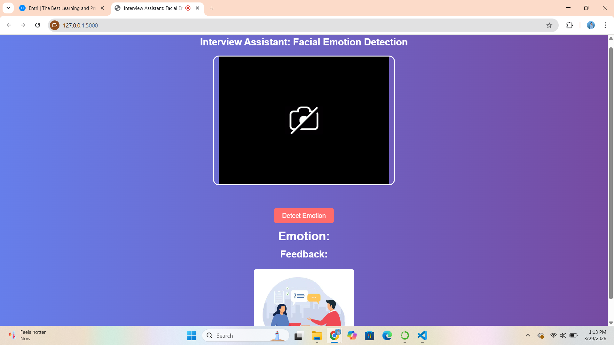
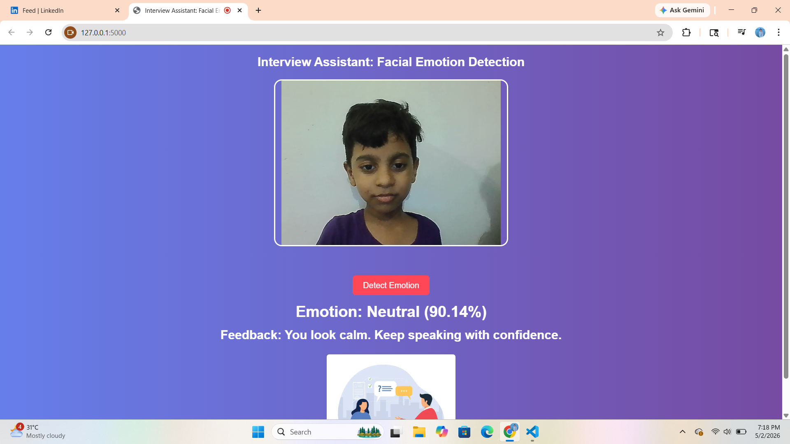
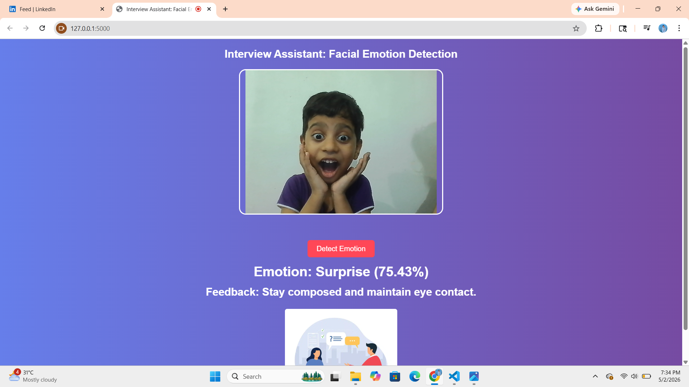
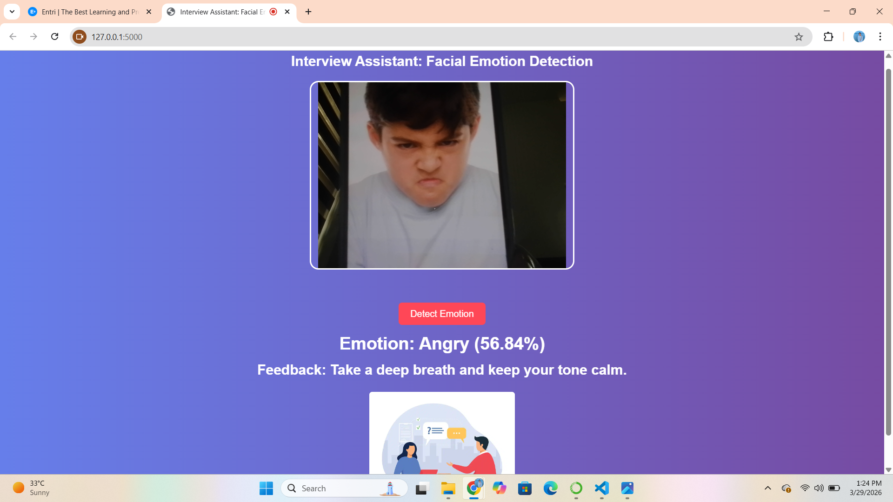

# **Interview Assistant: A Facial Emotion Detection Project**

## *Objective :*

The project focuses on making a facial emotion detection interview assistant that keeps track of the person's facial emotion and generate feedback. We can identify what the person is trying to convey by looking at their facial expressions. As they say, "a picture is worth a thousand." A conversation is 5% verbal and 95% non-verbal, and in an attempt to try to help machine understand what we do, we try to teach it the concept of "emotion" by training it on facial emotion datasets.
This project will help a you to enhance your interview skills and performance in interview.

This project combines:

- **Deep Learning** for emotion classification
  
- **Computer Vision** for image preprocessing and face detection
  
- **Flask** for backend integration
  
- **Frontend UI** for user interaction

## *Dataset Used :*

The dataset used for this project was taken from the kaggle repository :https://www.kaggle.com/code/enesztrk/facial-emotion-recognition-vgg19-fer2013

## *Pre-requisites*

**Knowledge Pre-requisits**

 - Basic Deep Learning concepts
 - Basics of Convolutional Neural Networks

## Features

- Detects facial emotion from uploaded images
  
- Uses a CNN model trained on facial expression data
  
- Supports 7 emotion classes:
  
  - Angry
  - Disgust
  - Fear
  - Happy
  - Sad
  - Surprise
  - Neutral
- Simple and interactive web interface
- Image preprocessing using OpenCV
- Model integration with Flask

## Model Output Preview

## Tools required

- Python
- TensorFlow / Keras
- OpenCV
- NumPy
- Pandas
- Matplotlib
- Flask
- scikit-learn
- HTML
- CSS
- JavaScript

**Name:** Anamika Suresh

**Title of DL project:** Interview Assistant: A Facial Emotion Detection Project

**Organization :**  Entri Elevate

